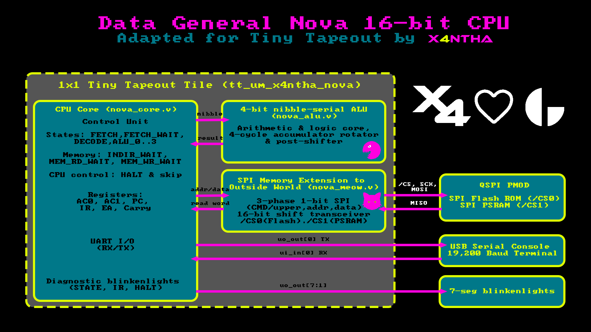
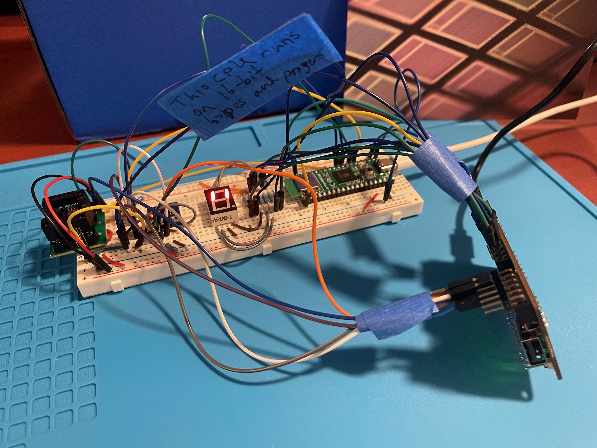

<!---
This file is used to generate your project datasheet. Please fill in the information below and delete any unused
sections.

You can also include images in this folder and reference them in the markdown. Each image must be less than
512 kb in size, and the combined size of all images must be less than 1 MB.
-->
```text
              DDDDDDDD
          DDDDDDDDDDDD
       DDDDDDDDDDDDDDD
    DDDDDDDDDDDDDDDDDD
  DDDDDDDDDDDDDDDDDDDD
 DDDDDDDDDDDDDDDDDDDDD
DDDDDDDDDDDDDDDDDDDDDD
DDDDDDDDDDDDDDDDDDDDDD
DDDDDDDDDDDDDDDDDDDDDD   GGGGGGGGGGGGGGGGGGGGGG
DDDDDDDDDDDDDDDDDDDDDD   GGGGGGGGGGGGGGGGGGGGGG
 DDDDDDDDDDDDDDDDDDDDD   GGGGGGGGGGGGGGGGGGGGG
  DDDDDDDDDDDDDDDDDDDD   GGGGGGGGGGGGGGGGGGGG
    DDDDDDDDDDDDDDDDDD   GGGGGGGGGGGGGGGGGG
       DDDDDDDDDDDDDDD   GGGGGGGGGGGGGGG
          DDDDDDDDDDDD   GGGGGGGGGGGG
              DDDDDDDD   GGGGGGGG          X4
```

# Data General Nova 16-Bit CPU for Tiny Tapeout

This is my first tapeout, and I decided to challenge myself with trying to build a single-tile 16-bit Data General Nova CPU in Verilog, based on the minicomputer architecture used by the Nova 1200. While fitting a 16-bit CPU on a single tapeout tile is ambitious, I believed it could be possible with some adjustments due to a 4-bit nibble-serial datapath used for the ALU.

A little bit of history: Data General was founded in 1968 by four engineers, three of whom were former employees of Digital Equipment Corporation (DEC), the company famous for minicomputers like the PDP-8. DEC had expressed no interest in moving from 12-bit to 16-bit architectures at the time, so three engineers left to start Data General and build the new design themselves. They went through years of commercial success for their 16-bit machines, then later developed the 16-bit (later 32-bit) Eclipse: the intense development process of the 32-bit Eclipse MV/8000 became the inspiration for the Pulitzer Prize-winning Tracy Kidder book, *The Soul of a New Machine*. They also helped define the future of portable laptop computers with the Data General/One in 1984.

A few modifications were necessary to fit the design on a single tile. The main difference from the original Nova is that AC0-AC3 were reduced to AC0-AC1, as the reality of four 16-bit accumulators plus multiplexing logic was simply too much for a single tile. This doesn't actually have much impact outside of some software compatibility, as the extra registers aren't used very often in simple programs and I was able to easily modify JSR to store PC in AC1 rather than AC3. The other architecture difference is the exclusion of the memory reference operations ISZ (Increment and Skip if Zero) and DSZ (Decrement and Skip if Zero). I otherwise tried to stay as close to the original Nova architecture as possible.


Tile Utilization: 88.614%

---

## How it works

The Tiny Tapeout Nova CPU is fully programmable assuming a QSPI PMOD is being used with the demoboard. Full details on flashing the CPU and testing can be found below, in the "How to test" section. At a high level, the Nova CPU continuously fetches instructions from Flash, decodes them, and executes them:

1. **Fetching**: When power is applied and reset is released, the CPU begins reading 16-bit instruction words from the Flash ROM.
2. **Processing**: The CPU decodes each instruction and carries out arithmetic, logic, or data transfers using its internal general-purpose registers (`AC0` and `AC1`). Temporary data and variables are stored in PSRAM. Much like the original Nova 1200, the Tiny Tapeout implementation of the CPU processes 16-bit math 4 bits at a time.
3. **Communicating**: The chip includes a built-in serial UART transceiver operating at 19,200 Baud at the standard 1.5 MHz demoboard clock. The baud rate is determined by a fixed hardware clock divider of 78 cycles per bit ($\text{Baud} = f_{\text{clk}} / 78$). When a program wants to print text or wait for input, it communicates over `ui_in[0]` (RX) and `uo_out[0]` (TX). This allows for interactive terminal I/O, which the example program below demonstrates.
4. **Blinkenlights**: As the CPU runs, it drives diagnostic blinkenlight signals on the output pins (`uo_out[7:1]`), using the demoboard's 7-segment display to show the CPU's major cycle, active instruction class, UART send/receive status, and halt status.

```text
Das Blinkenlights!
  uo[7]      uo[6],uo[5],uo[4]    uo[3],uo[2],uo[1]      uo[0]
 ----------------------------------------------------------------
| HALTED   |     IR_OP[2:0]     |     STATE[2:0]    |  UART_TX  |
| (Halt)   |    (Instruction)   |   (Major Cycle)   |  (Serial) |
 ----------------------------------------------------------------
```



---

## How to test

Nova programs are stored in Flash. Words are stored in **big-endian format**. I have included a Python script so it's possible to write Nova assembly, and the full Nova instruction set is given below. (I highly recommend sharing your Nova programs on Discord or GitHub if you create something cool! I haven't tried writing DOOM yet.)

### Step 1: Write and assemble a program

You can assemble your Nova code using the self-contained `make_rom.py` script:

```python
#!/usr/bin/env python3
"""
make_rom.py
DG Nova assembly -> big-endian binary (rom.bin)
Copyright (c) 2026 X4NTHA, x4ntha.com
SPDX-License-Identifier: Apache-2.0
"""
import re, sys

# demo assembly program: interactive UART echo
ASM_SOURCE = """
; interactive UART echo
START:  SKPDN 010        ; check if char was received on UART RX (Dev 0o10)
        JMP   START      ; wait for char
        DIAC  0, 010     ; read char into AC0 (clears RX done flag)
WAIT:   SKPBZ 011        ; wait until UART TX (Dev 0o11) is ready
        JMP   WAIT       ; wait
        DOAS  0, 011     ; echo char back out via UART TX (with start pulse)
        JMP   START      ; loop indefinitely for next char
"""

def assemble_nova(source_text):
    """
    assembles Nova asm into a list of 16-bit words
    """
    lines = source_text.strip().split('\n')
    rom = [0] * 16384 # 16K words, 32 KB
    labels = {}
    cleaned = []
    pc = 0
    
    def parse_string_bytes(s):
        m = re.search(r'"([^"\\]*(?:\\.[^"\\]*)*)"', s)
        if not m: return []
        content = m.group(1).encode('utf-8').decode('unicode_escape')
        byte_list = [ord(c) for c in content] + [0]
        words = []
        for i in range(0, len(byte_list), 2):
            b_hi = byte_list[i]
            b_lo = byte_list[i+1] if (i+1 < len(byte_list)) else 0
            words.append((b_hi << 8) | b_lo)
        return words

    # pass 1: strip comments, extract labels, map PC
    for raw in lines:
        line = re.sub(r'[;#].*$', '', raw).strip()
        if not line: continue
        while True:
            m_lbl = re.match(r'^([A-Za-z0-9_]+):\s*(.*)$', line)
            if m_lbl:
                labels[m_lbl.group(1)] = pc
                line = m_lbl.group(2).strip()
            else:
                break
        if line:
            cleaned.append((pc, line))
            if line.upper().startswith('.STRING') or line.upper().startswith('.TXT'):
                str_words = parse_string_bytes(line)
                pc += max(1, len(str_words))
            else:
                pc += 1
            
    # instruction lookup
    alc_ops = {'COM':0, 'NEG':1, 'MOV':2, 'INC':3, 'ADC':4, 'SUB':5, 'ADD':6, 'AND':7}
    alc_shifts = {'L':1, 'R':2, 'S':3}
    alc_carries = {'Z':1, 'O':2, 'C':3}
    alc_skips = {'SKP':1, 'SZC':2, 'SNC':3, 'SZR':4, 'SNR':5, 'SEZ':6, 'SBN':7}
    io_trans = {'NIO':0, 'DIA':1, 'DOA':2, 'DIB':3, 'DOB':4, 'DIC':5, 'DOC':6}
    io_skips = {'SKPBN':0, 'SKPBZ':1, 'SKPDN':2, 'SKPDZ':3}
    mrc_ops = {'JMP':(0,0), 'JSR':(0,1), 'LDA':(1,None), 'STA':(2,None)}
    
    # resolve labels, current PC, offsets, numeric literals
    def resolve_val(s, curr_pc):
        s = s.strip()
        if s == '.': return curr_pc
        if s in labels: return labels[s]
        m = re.match(r'^([\w\.]+)\s*([\+\-])\s*(\d+)$', s)
        if m:
            sym, sign, val = m.groups()
            base = curr_pc if sym == '.' else labels.get(sym, int(sym, 0))
            return (base + int(val, 0)) if sign == '+' else (base - int(val, 0))
        return int(s, 0)

    # pass 2: encode instructions into 16-bit binary words
    for curr_pc, line in cleaned:
        if line.upper().startswith('.STRING') or line.upper().startswith('.TXT'):
            words = parse_string_bytes(line)
            for idx, w in enumerate(words):
                rom[curr_pc + idx] = w & 0xFFFF
            continue

        if line.upper().startswith('.WORD'):
            val_str = line.split(None, 1)[1]
            rom[curr_pc] = resolve_val(val_str, curr_pc) & 0xFFFF
            continue
            
        tokens = [t.strip() for t in re.split(r'[\s,]+', line) if t.strip()]
        mnemonic = tokens[0].upper()
        args = tokens[1:]
        
        # CPU control
        if mnemonic == 'HALT':
            rom[curr_pc] = 0x633F
            continue
        if mnemonic == 'IORST':
            rom[curr_pc] = 0x65BF
            continue
            
        # I/O skip
        if mnemonic in io_skips:
            ctrl = io_skips[mnemonic]
            dev = int(args[0], 8) if args[0].startswith('0') else int(args[0])
            rom[curr_pc] = (0 << 0) | (3 << 1) | (0 << 3) | (7 << 5) | (ctrl << 8) | ((dev & 0x3F) << 10)
            continue
            
        # I/O data transfer instructions (DIA, DOA, NIO, DIAS, DIAC, DOAS, DOAC, etc.)
        base_io = mnemonic[:3]
        suffix_io = mnemonic[3:] if len(mnemonic) > 3 else ''
        if base_io in io_trans and suffix_io in ('', 'S', 'C', 'P'):
            trans = io_trans[base_io]
            ctrl = {'':0, 'S':1, 'C':2, 'P':3}[suffix_io]
            ac = int(args[0].replace('AC', '')) if base_io != 'NIO' else 0
            dev = int(args[1], 8) if (len(args) > 1 and args[1].startswith('0')) else (int(args[1]) if len(args) > 1 else int(args[0], 8))
            rom[curr_pc] = (0 << 0) | (3 << 1) | ((ac & 3) << 3) | ((trans & 7) << 5) | ((ctrl & 3) << 8) | ((dev & 0x3F) << 10)
            continue
            
        # MRC
        base_mrc = None
        for k in mrc_ops:
            if mnemonic.startswith(k):
                base_mrc = k
                break
        if base_mrc:
            indir = 1 if ('@' in mnemonic or any('@' in a for a in args)) else 0
            clean_args = [re.sub(r'^AC(?=[0-3]|$)', '', a.replace('@', ''), flags=re.I) for a in args]
            mode, func = mrc_ops[base_mrc]
            if mode == 0:
                func_or_ac = func
                target = clean_args[0]
            else:
                func_or_ac = int(clean_args[0])
                target = clean_args[1]

            explicit_index = len(clean_args) > (1 if mode == 0 else 2)
            if explicit_index:
                index = int(clean_args[1 if mode == 0 else 2])
            else:
                if target.startswith('.'):
                    index = 1
                else:
                    addr_val_temp = resolve_val(target, curr_pc)
                    if addr_val_temp < 256:
                        index = 0
                    elif -128 <= (addr_val_temp - (curr_pc + 1)) <= 127:
                        index = 1
                    else:
                        index = 0
                
            addr_val = resolve_val(target, curr_pc)
            disp = (addr_val - (curr_pc + 1)) if index == 1 else addr_val
            rom[curr_pc] = (0 << 0) | ((mode & 3) << 1) | ((func_or_ac & 3) << 3) | ((indir & 1) << 5) | ((index & 3) << 6) | ((disp & 0xFF) << 8)
            continue
            
        # ALC
        m = re.match(r'^(COM|NEG|MOV|INC|ADC|SUB|ADD|AND)([LRS]?)([ZOC]?)(#?)$', mnemonic)
        if m:
            op_str, sh_str, c_str, nl_str = m.groups()
            op = alc_ops[op_str]
            shift = alc_shifts.get(sh_str, 0)
            carry = alc_carries.get(c_str, 0)
            no_load = 1 if nl_str == '#' else 0
            clean_args = [re.sub(r'^AC(?=[0-3]|$)', '', a, flags=re.I) for a in args]
            acs = int(clean_args[0])
            acd = int(clean_args[1])
            skip = alc_skips.get(clean_args[2].upper(), 0) if len(clean_args) > 2 else 0
            rom[curr_pc] = (1 << 0) | ((acs & 3) << 1) | ((acd & 3) << 3) | ((op & 7) << 5) | ((shift & 3) << 8) | ((carry & 3) << 10) | ((no_load & 1) << 12) | ((skip & 7) << 13)
            continue
            
        raise ValueError(f"unknown instruction at line {curr_pc}: {line}")
        
    return rom

if __name__ == '__main__':
    source = ASM_SOURCE
    if len(sys.argv) > 1:
        with open(sys.argv[1], 'r') as f:
            source = f.read()
            
    # compile asm to bin
    rom = assemble_nova(source)
    with open("rom.bin", "wb") as f:
        for word in rom:
            f.write(bytes([(word >> 8) & 0xFF, word & 0xFF]))
    print("compiled rom.bin successfully!")
```

To compile your code into `rom.bin`:
```bash
# assemble the embedded program:
python make_rom.py

# assemble an .asm file:
python make_rom.py my_program.asm
```

### Step 2: Test on the Tiny Tapeout demoboard

1. **Plug in the QSPI PMOD**: Insert the official Tiny Tapeout Flash/PSRAM QSPI PMOD into the **BIDIR (`uio`) PMOD connector**.
2. **Set DIP Switches to OFF**: Ensure all 8 input DIP switches (`ui[7:0]`) on the demoboard are set to **OFF**. Specifically, DIP switch 1 (`ui[0]`) connects to UART RX; leaving it ON will clamp the line and prevent keyboard input from reaching the CPU.
3. **Flash the ROM**:
   * **Tiny Tapeout webapp**: Open [app.tinytapeout.com](https://app.tinytapeout.com), select this project (`tt_um_x4ntha_nova`), and flash `rom.bin` to the PMOD.
   * **or via CLI**: Run `python -m tt_board flash --pmod-flash rom.bin`
4. **Select the project**: Select the project on the demoboard (`tt_um_x4ntha_nova`). The demoboard will automatically configure the system clock to **1.5 MHz**.
5. **Open terminal**: Connect a serial terminal (screen, PuTTY, etc.) to the demoboard's virtual COM port at **19,200 Baud (8N1)**.
6. **Interact**: With the example project, typing characters into your terminal will result in the Nova CPU echoing them back. The onboard 7-segment display will actively display CPU execution state and instruction telemetry.

---

### Nova Instruction Set Quick Reference

#### A. Arithmetic & Logic Class (ALC)
**Syntax:** `OP[sh][c][#] acs, acd [,skip]`  
*Example:* `ADD 0, 1` (Add AC0 to AC1), `SUBO# 0, 1, SZR` (Compare AC0 and AC1, skip if equal).

| Field | Options | Description |
| :--- | :--- | :--- |
| **Opcode** | `COM` (`op=0`) | Complement: $ACD \leftarrow \sim ACS$ |
| | `NEG` (`op=1`) | Negate: $ACD \leftarrow -ACS$ |
| | `MOV` (`op=2`) | Move: $ACD \leftarrow ACS$ |
| | `INC` (`op=3`) | Increment: $ACD \leftarrow ACS + 1$ |
| | `ADC` (`op=4`) | Add Complement: $ACD \leftarrow \sim ACS + ACD$ |
| | `SUB` (`op=5`) | Subtract: $ACD \leftarrow ACD - ACS$ (use `carry=2` / `O` for exact $ACD - ACS$) |
| | `ADD` (`op=6`) | Add: $ACD \leftarrow ACS + ACD$ |
| | `AND` (`op=7`) | Bitwise AND: $ACD \leftarrow ACS \ \& \ ACD$ |
| **Shift (`sh`)** | `None` (`shift=0`) | Direct 16-bit transfer |
| | `L` (`shift=1`) | Rotate Left 16-bit word through Carry |
| | `R` (`shift=2`) | Rotate Right 16-bit word through Carry |
| | `S` (`shift=3`) | Byte Swap: Swap upper and lower 8-bit bytes |
| **Carry (`c`)** | `None` (`carry=0`) | Use existing Carry flag |
| | `Z` (`carry=1`) | Initialize Carry-in to `0` |
| | `O` (`carry=2`) | Initialize Carry-in to `1` |
| | `C` (`carry=3`) | Initialize Carry-in to $\sim\text{Carry}$ |
| **No-Load** | `#` (`no_load=1`) | Perform calculation, evaluate skip/flags, but **do not alter** destination AC |
| **Skip** | `None` (`skip=0`) | Never skip |
| | `SKP` (`skip=1`) | Always skip next instruction |
| | `SZC` (`skip=2`) | Skip if Carry is Zero (`C == 0`) |
| | `SNC` (`skip=3`) | Skip if Carry is Non-zero (`C == 1`) |
| | `SZR` (`skip=4`) | Skip if Result is Zero (`Result == 0`) |
| | `SNR` (`skip=5`) | Skip if Result is Non-zero (`Result != 0`) |
| | `SEZ` (`skip=6`) | Skip if either Carry or Result is Zero (`C == 0` or `Result == 0`) |
| | `SBN` (`skip=7`) | Skip if both Carry and Result are Non-zero (`C == 1` and `Result != 0`) |

---

#### B. Memory Reference Class (MRC)
**Syntax:** `OP[@] ac, disp [,index]`  
*Example:* `LDA 0, 0x40` (Load AC0 from Page 0 addr 0x40), `STA 1, @0x41` (Indirect store AC1 via pointer at 0x41), `JMP 0, 1` (PC-relative jump).

| Opcode | `mode` | `func_or_ac` | Description |
| :--- | :--- | :--- | :--- |
| `LDA` | `1` | `0..1` (AC) | Load Accumulator from memory address: $AC \leftarrow M[EA]$ |
| `STA` | `2` | `0..1` (AC) | Store Accumulator into memory address: $M[EA] \leftarrow AC$ |
| `JMP` | `0` | `0` | Jump: $PC \leftarrow EA$ |
| `JSR` | `0` | `1` | Jump to Subroutine: $AC1 \leftarrow PC + 1$, $PC \leftarrow EA$ |

* **Addressing Modes (`index`)**:
  * `index=0` (Page 0): $EA = \text{disp}$ (Direct address `0x0000` to `0x00FF`).
  * `index=1` (PC-relative): $EA = PC + \text{disp}$ (Signed $\pm 128$).
  * `index=2` (AC0-indexed): $EA = AC0 + \text{disp}$ (Signed $\pm 128$).
  * `index=3` (AC1-indexed): $EA = AC1 + \text{disp}$ (Signed $\pm 128$).
* **Indirect Bit (`indir=1` / `@`)**: Treats $M[EA]$ as a 15-bit address pointer to fetch the final operand.
* **Memory Map**:
  * `0x0000` - `0x3FFF` (16,384 words / 32 KB): SPI Flash ROM (`CS0#` on `uio[0]`). Contains instructions and constants.
  * `0x4000` - `0x7FFF` (16,384 words / 32 KB): QSPI PSRAM RAM (`CS1#` on `uio[6]`). Read/write working memory.

---

#### C. Input/Output Class (I/O)
**Syntax:** `IO_OP[c] ac, dev`  
*Example:* `DIA 0, 010` (Read char into AC0 from Keyboard), `DOA 1, 011` (Print char from AC1 to UART).

| Transfer | `transfer` | Description |
| :--- | :--- | :--- |
| `NIO` | `0` | No transfer (control functions only) |
| `DIA` | `1` | Data In A: Read Device buffer into $AC[7:0]$ (zero extends upper 8 bits) |
| `DOA` | `2` | Data Out A: Send $AC[7:0]$ to Device transmitter |
| `DOC` | `6` | `DOC 0, 077` $\rightarrow$ **HALT** (Halts CPU execution) |
| `DICC` | `5` | `DICC 0, 077` $\rightarrow$ **IORST** (Reset UART flags) |
| `SKP` | `7` | Skip on Device Flag (`control=0: SKPBN`, `1: SKPBZ`, `2: SKPDN`, `3: SKPDZ`) |

* **Device Codes**:
  * `0o10` (Octal 10): Keyboard / UART RX Buffer (Done flag set on incoming byte).
  * `0o11` (Octal 11): Printer / UART TX Transmitter (Busy flag set while transmitting, Done flag on completion).
  * `0o77` (Octal 77): CPU Control (`HALT`, `IORST`).

---

## External hardware

The official Tiny Tapeout QSPI PMOD is used in this project for Flash/PSRAM over 1-bit SPI:
* `uio[0]`: Flash Chip Select (`CS0#`, active LOW)
* `uio[1]`: SPI MOSI (`SIO0`)
* `uio[2]`: SPI MISO (`SIO1`, input)
* `uio[3]`: SPI SCK (Serial Clock, driven at $f_{\text{clk}} / 2$)
* `uio[4]`: PSRAM `SIO2 / WP#` (driven HIGH internally to disable write protection in 1-bit mode)
* `uio[5]`: PSRAM `SIO3 / HOLD#` (driven HIGH internally to disable hold in 1-bit mode)
* `uio[6]`: PSRAM Chip Select (`CS1#`, active LOW)
* `uio[7]`: Unused (parked HIGH)

You can also wire Flash/PSRAM manually if you have spare components, like I did for my Tangy Tapeout FPGA testbed implementation:


